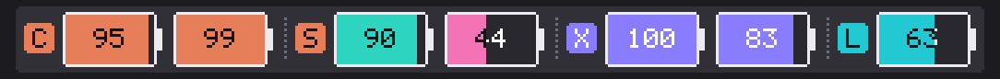
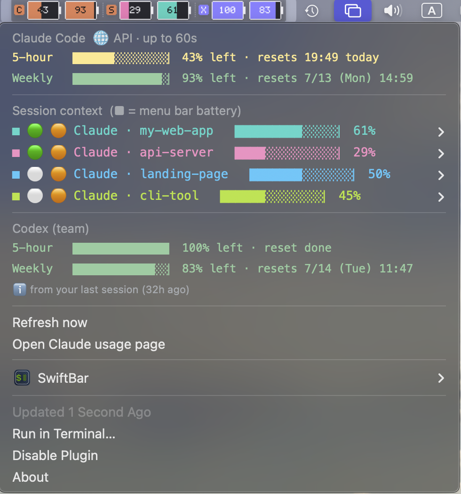

# tokenjuice 🔋

**See how much Claude Code & Codex you have left — right in your menu bar.**

A [SwiftBar](https://github.com/swiftbar/SwiftBar) plugin that shows your Claude Code / Codex usage limits *and* your live session context window as battery icons. Green = go, red = wrap it up.



<p align="center">
  
  
  
</p>

<p align="center">
  
  <br><sub>Click the battery for a full breakdown — per-limit resets and every active session's context window.</sub>
</p>

<p align="center"><i><a href="#한국어">🇰🇷 한국어 아래로 ↓</a></i></p>

```
 C [95][99]   ┊   S [30][79]   ┊   X [100][83]   ┊   L [63]
```

| | Battery | Shows |
|---|---|---|
| **C** | 🟠 orange | Claude Code 5-hour & weekly limits remaining |
| **S** | 🎨 per-session | Live **context window** left in your active sessions (know before compaction hits) |
| **X** | 🟣 violet | Codex 5-hour & weekly limits remaining |
| **L** | 🩵 cyan | Letsur gateway monthly budget (optional) |

The number = **% remaining**. Under 20% turns red.

---

## Requirements

- **macOS** (menu bar is macOS-only — see [Windows / Linux](#windows--linux) for the CLI)
- **[bun](https://bun.sh)** — the runtime (installer offers to set it up for you)
- **[SwiftBar](https://github.com/swiftbar/SwiftBar)** — the menu bar host (installer sets it up via Homebrew)
- **You must be logged into Claude Code** (`claude` in a terminal) — that's where usage data comes from

## Install

```bash
git clone https://github.com/kendrick-na/tokenjuice.git
cd tokenjuice
./install.sh
```

The installer checks bun & SwiftBar (offering to install what's missing), registers the plugin, and launches SwiftBar.

> **First run:** macOS may show a **keychain access** prompt — click **Always Allow**. It's used to read your Claude usage; no token is ever stored. If the battery says "log in first," run `claude` and sign in.

## Refresh rate

The filename `claude-codex-battery.5s.js` → refreshes every **5 seconds**.
- **Session context** is read from local transcript files every run → effectively real-time.
- **Claude/Codex limit APIs** are cached for 60s (so a 5s loop still calls the API only ~once/min).

Rename to `.2s.js` for faster, `.30s.js` for slower.

## Where the data comes from

| Group | Source |
|-------|--------|
| Claude limits | **①** local cache `~/.claude/**/usage-cache.json` (real-time, no network) if present → **②** fallback to `api.anthropic.com/api/oauth/usage` (keychain OAuth token, 60s cache) |
| Session context | `~/.claude/projects/*/*.jsonl` — last usage totals |
| Codex limits | `~/.codex/sessions/**/*.jsonl` — latest `rate_limits` |

## Sessions (S)

- Merges **Claude Code + Codex** sessions, newest first (🟠 Claude / 🟣 Codex in the dropdown).
- Menu bar shows the **3 most at-risk** sessions (least context left) + a `+N` badge; the dropdown lists up to 8 with project, topic, git branch, model, tokens.
- Each session gets a distinct color — menu bar battery matches the `■` swatch in the dropdown.
- `⚠️ compaction imminent` warning above 80% context used.

## Letsur (optional gateway budget)

Letsur has no "remaining balance" API — responses only carry `estimated_cost`. So tokenjuice tracks **cumulative spend vs a monthly limit** you set.

`~/.config/claude-codex-battery/letsur.json`:
```json
{ "monthlyLimit": 100, "currency": "unit", "label": "Letsur" }
```
Feed spend via `bun claude-codex-battery.5s.js letsur add <cost>` (from a proxy/wrapper), or point `usageFile` at a `{ "spent": <n> }` JSON. Auto-resets on the 1st of each month.

## Multiple accounts

Split config dirs and tokenjuice auto-detects each + labels it from `.claude.json` → `oauthAccount` (org/email):
```bash
CLAUDE_CONFIG_DIR=~/.claude-work claude   # log into your work account here
```
`~/.claude` and `~/.claude-work` then show as separate battery groups. Manual override: `~/.config/claude-codex-battery/accounts.json`.

## Windows / Linux

The **data logic is cross-platform**, but the **menu bar display is macOS-only**. On other OSes, use CLI mode and pipe it into your own tray/bar:
```bash
bun claude-codex-battery.5s.js --text   # human-readable
bun claude-codex-battery.5s.js --json    # for tray widgets (Waybar, polybar, ...)
```

## License

MIT

---

<a name="한국어"></a>

# tokenjuice 🔋 (한국어)

**Claude Code & Codex 얼마나 남았는지 — 맥 메뉴바에서 배터리로.**

Claude Code / Codex 사용 한도와 **지금 세션의 컨텍스트 잔량**을 배터리로 보여주는 [SwiftBar](https://github.com/swiftbar/SwiftBar) 플러그인. 초록=여유, 빨강=곧 소진.

| | 배터리 | 표시 |
|---|---|---|
| **C** | 🟠 주황 | Claude Code 5시간·주간 한도 잔량 |
| **S** | 🎨 세션색 | 지금 작업 중인 세션의 **컨텍스트 창** 잔량 (컴팩트 전에 미리 앎) |
| **X** | 🟣 보라 | Codex 5시간·주간 한도 잔량 |
| **L** | 🩵 청록 | Letsur 게이트웨이 월 한도 (선택) |

배터리 숫자 = **남은 %**. 20% 미만은 빨강 경고.

## 준비물

- **macOS** (메뉴바는 맥 전용 — 윈도우/리눅스는 CLI 모드)
- **[bun](https://bun.sh)** — 런타임 (설치 스크립트가 자동 설치 제안)
- **[SwiftBar](https://github.com/swiftbar/SwiftBar)** — 메뉴바 호스트 (설치 스크립트가 brew로 설치)
- **Claude Code에 로그인돼 있어야 함** (터미널에서 `claude`) — 사용량 데이터 출처

## 설치

```bash
git clone https://github.com/kendrick-na/tokenjuice.git
cd tokenjuice
./install.sh
```

bun·SwiftBar를 확인(없으면 설치 제안)하고 플러그인을 등록한 뒤 SwiftBar를 띄운다.

> **첫 실행:** macOS **키체인 접근** 창이 뜨면 **"항상 허용"** 클릭. Claude 사용량을 읽기 위한 것으로 토큰은 저장하지 않는다. 배터리에 "로그인하세요"가 뜨면 터미널에서 `claude` 실행 후 로그인.

## 갱신 주기

파일명 `...5s.js` → **5초마다**. 세션 컨텍스트는 로컬 파일이라 사실상 실시간, 사용량 API는 60초 캐싱(레이트리밋 보호). `.2s.js`로 더 빠르게, `.30s.js`로 느리게.

## 데이터 출처 · 세션 · 멀티계정 · Letsur

위 영문 섹션과 동일 — 요약: Claude 한도는 **로컬 캐시 우선 → API 폴백**, 세션은 Claude+Codex 병합·위험순 3개+`+N`, 멀티계정은 config-dir 자동 감지, Letsur는 월 한도 대비 누적. CLI 모드(`--json`/`--text`)로 윈도우/리눅스 트레이에 연동 가능.

## 라이선스

MIT
