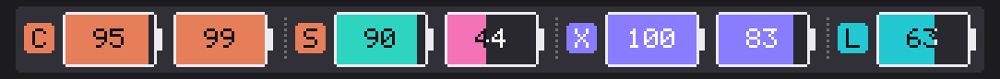
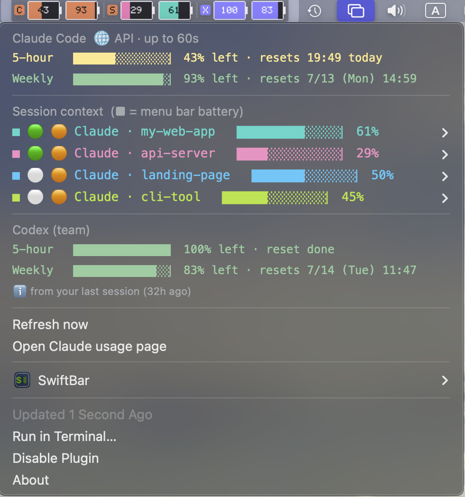

# tokenjuice 🔋

**See how much Claude Code & Codex you have left — right in your menu bar.**

Shows your Claude Code / Codex usage limits *and* your live session context window as battery icons — in the **macOS menu bar** ([SwiftBar](https://github.com/swiftbar/SwiftBar)) or the **Windows system tray**. Green = go, red = wrap it up.



<p align="center">
  
  
  
</p>

<p align="center">
  
  <br><sub>Click the battery for a full breakdown — per-limit resets and every active session's context window.</sub>
</p>

<p align="center"><i><a href="#한국어">🇰🇷 한국어 아래로 ↓</a></i></p>

```
 C [95][99]   ┊   S [30][79]   ┊   X [100][83]   ┊   L [63]
```

| | Battery | Shows |
|---|---|---|
| **C** | 🟠 orange | Claude Code 5-hour & weekly limits remaining |
| **S** | 🎨 per-session | Live **context window** left in your active sessions (know before compaction hits) |
| **X** | 🟣 violet | Codex 5-hour & weekly limits remaining |
| **L** | 🩵 cyan | Letsur gateway monthly budget (optional) |

The number = **% remaining**. Under 20% turns red.

---

> **On Windows?** Jump to [Windows](#windows) — there's a native system-tray build.

## Requirements

- **macOS** or **Windows 10/11** (Linux: CLI only, see [Linux](#linux))
- **[bun](https://bun.sh)** — the runtime (installer offers to set it up for you)
- **[SwiftBar](https://github.com/swiftbar/SwiftBar)** — macOS only, the menu bar host (installer sets it up via Homebrew)
- **Claude Code and/or Codex installed & used** — tokenjuice reads their local files (no login step needed unless you opt into API mode; see [Privacy & security](#privacy--security))

## Install (macOS)

```bash
git clone https://github.com/kendrick-na/tokenjuice.git
cd tokenjuice
./install.sh
```

The installer checks bun & SwiftBar (auto-installing what's missing), registers the plugin, launches SwiftBar, and adds it to your login items so it survives reboots.

> **No keychain prompt by default.** Sessions & Codex work from local files immediately. Claude limits only need the keychain if you turn on [API mode](#privacy--security) — and only then does macOS ask you to *Always Allow*.

### Install it with an AI agent

Hand this repo to Claude Code (or any coding agent) and let it do the work:

> Clone https://github.com/kendrick-na/tokenjuice and run its `install.sh` for me. The installer is non-interactive-safe, so it won't block.

`install.sh` auto-proceeds when there's no TTY (or set `CCB_YES=1`), so an agent can run it end-to-end — and it needs **no** keychain or login step by default. (Only if you later opt into API mode does macOS ask you to click *Always Allow* once — an agent can't click that for you.)

## Refresh rate

The filename `claude-codex-battery.5s.js` → refreshes every **5 seconds**.
- **Session context** is read from local transcript files every run → effectively real-time.
- **Claude/Codex limit APIs** are cached for 60s (so a 5s loop still calls the API only ~once/min).

Rename to `.2s.js` for faster, `.30s.js` for slower.

## Where the data comes from

| Group | Source |
|-------|--------|
| Claude limits | **①** local cache `~/.claude/**/usage-cache.json` (real-time, no network, **no keychain**) if present → **②** *opt-in* API mode: `api.anthropic.com/api/oauth/usage` (60s cache) |
| Session context | `~/.claude/projects/*/*.jsonl` — last usage totals (local files) |
| Codex limits | `~/.codex/sessions/**/*.jsonl` — latest `rate_limits` (local files) |

## Privacy & security

Everything reads **your own local files** and renders locally. Specifically:

- **By default, tokenjuice never touches your keychain.** Sessions and Codex read local files only. Claude limits read a local cache file if your Claude Code version writes one.
- **API mode is strictly opt-in.** Some Claude Code versions don't write a local usage cache. Only then, *and only if you explicitly turn it on* (`export CCB_API=1` or `config.json {"api": true}`), does tokenjuice read the Claude OAuth token from your keychain to call the **read-only** usage endpoint. The token is used in-memory for that one request — never stored, never sent anywhere else.
- **Nothing leaves your machine** except that optional usage call to Anthropic's own API.
- **It's one auditable file** (~35 KB of plain JS, no dependencies). Read it before you run it.

## Sessions (S)

- Merges **Claude Code + Codex** sessions, newest first (🟠 Claude / 🟣 Codex in the dropdown).
- Menu bar shows the **3 most at-risk** sessions (least context left) + a `+N` badge; the dropdown lists up to 8 with project, topic, git branch, model, tokens.
- Each session gets a distinct color — menu bar battery matches the `■` swatch in the dropdown.
- `⚠️ compaction imminent` warning above 80% context used.

## Letsur (optional gateway budget)

Letsur has no "remaining balance" API — responses only carry `estimated_cost`. So tokenjuice tracks **cumulative spend vs a monthly limit** you set.

`~/.config/claude-codex-battery/letsur.json`:
```json
{ "monthlyLimit": 100, "currency": "unit", "label": "Letsur" }
```
Feed spend via `bun claude-codex-battery.5s.js letsur add <cost>` (from a proxy/wrapper), or point `usageFile` at a `{ "spent": <n> }` JSON. Auto-resets on the 1st of each month.

## Multiple accounts

Split config dirs and tokenjuice auto-detects each + labels it from `.claude.json` → `oauthAccount` (org/email):
```bash
CLAUDE_CONFIG_DIR=~/.claude-work claude   # log into your work account here
```
`~/.claude` and `~/.claude-work` then show as separate battery groups. Manual override: `~/.config/claude-codex-battery/accounts.json`.

## Windows

Same batteries, in the system tray. Both platforms run the **same engine**
(`claude-codex-battery.5s.js`) — only the drawing layer differs, so the numbers
can't drift between them.

### Option A — from source (2 commands)

```powershell
git clone https://github.com/kendrick-na/tokenjuice.git
cd tokenjuice\windows
.\install.ps1
```

`install.ps1` checks bun and Python (offering to install bun if missing),
installs the two Python packages, registers a start-at-login shortcut, runs a
smoke test, and launches the tray.

### Option B — the exe

Grab `tokenjuice.exe` from [Releases](https://github.com/kendrick-na/tokenjuice/releases),
keep `claude-codex-battery.5s.js` **in the same folder**, and double-click.
Python is bundled; you still need [bun](https://bun.sh):

```powershell
powershell -c "irm bun.sh/install.ps1 | iex"
```

> **Can't see the icon?** Windows hides new tray icons by default. Click the
> **^** arrow next to the clock, then drag tokenjuice onto the taskbar to pin it.

**Requirements:** Windows 10/11 · [bun](https://bun.sh) · Python 3.9+ (only for Option A)

### How the tray icon differs from the menu bar

The Windows tray gives an app ~16×16 px — far less than a macOS menu bar. So
instead of the wide `C [95][99]` strip, the tray stacks the **three tightest
batteries** vertically and puts every number in the menu, where there's room to
read it. Hover for a one-line summary; click for the full breakdown.

| State | Icon |
|---|---|
| Healthy | green battery, mostly full |
| Under 50% | yellow |
| Under 20% | red |
| Exhausted (0%) | red battery with an ✕ through it |
| No data yet | grey outline |
| Engine error | red ✕ (open the menu for the reason) |

### Windows-specific commands

```powershell
python tokenjuice_tray.py            # run in the foreground
python tokenjuice_tray.py --once     # print one reading and exit (debugging)
.\build-exe.ps1                      # build dist\tokenjuice.exe yourself
.\install.ps1 -NoAutostart           # install without start-at-login
```

To remove it: delete `tokenjuice.lnk` from your Startup folder
(`shell:startup`) and quit from the tray menu.

## Linux

No tray build. The engine is cross-platform, so feed the CLI into your own bar
(Waybar, polybar, i3blocks):

```bash
bun claude-codex-battery.5s.js --text   # human-readable
bun claude-codex-battery.5s.js --json   # structured, for tray widgets
```

## Privacy: session topics

A session's "topic" is **your raw prompt text**. Since a menu bar and a tray are
both visible in screen shares and screenshots, topics are **hidden by default**
on every platform, and stripped from `--json` entirely rather than merely
hidden at render time.

Turn them on only if you want them:

```bash
export CCB_TOPICS=1                                   # macOS / Linux
bun claude-codex-battery.5s.js --json --topics         # one-off
```
On Windows, use **Show prompt topics** in the tray menu. Or set
`{"topics": true}` in `~/.config/claude-codex-battery/config.json`.

## License

MIT

---

<a name="한국어"></a>

# tokenjuice 🔋 (한국어)

**Claude Code & Codex 얼마나 남았는지 — 맥 메뉴바에서 배터리로.**

Claude Code / Codex 사용 한도와 **지금 세션의 컨텍스트 잔량**을 배터리로 보여주는 [SwiftBar](https://github.com/swiftbar/SwiftBar) 플러그인. 초록=여유, 빨강=곧 소진.

| | 배터리 | 표시 |
|---|---|---|
| **C** | 🟠 주황 | Claude Code 5시간·주간 한도 잔량 |
| **S** | 🎨 세션색 | 지금 작업 중인 세션의 **컨텍스트 창** 잔량 (컴팩트 전에 미리 앎) |
| **X** | 🟣 보라 | Codex 5시간·주간 한도 잔량 |
| **L** | 🩵 청록 | Letsur 게이트웨이 월 한도 (선택) |

배터리 숫자 = **남은 %**. 20% 미만은 빨강 경고.

## 준비물

- **macOS** 또는 **Windows 10/11** (리눅스는 CLI 모드)
- **[bun](https://bun.sh)** — 런타임 (설치 스크립트가 자동 설치 제안)
- **[SwiftBar](https://github.com/swiftbar/SwiftBar)** — 맥 전용, 메뉴바 호스트 (설치 스크립트가 brew로 설치)
- **Claude Code에 로그인돼 있어야 함** (터미널에서 `claude`) — 사용량 데이터 출처

> **윈도우 사용자는** 아래 [윈도우](#윈도우) 섹션으로. 시스템 트레이 전용 빌드가 있다.

## 설치 (macOS)

```bash
git clone https://github.com/kendrick-na/tokenjuice.git
cd tokenjuice
./install.sh
```

bun·SwiftBar를 확인(없으면 자동 설치)하고 플러그인을 등록한 뒤 SwiftBar를 띄우고, **로그인 항목에 등록해 재부팅 후에도 자동 실행**되게 한다.

> **기본은 키체인 접근 없음.** 세션·Codex는 로컬 파일만 읽어 바로 뜬다. Claude 한도는 로컬 캐시가 없는 버전에서만, 그리고 **직접 API 모드를 켤 때만**(`export CCB_API=1`) 키체인 토큰을 읽는다. 그때만 macOS가 "항상 허용"을 묻는다.

**개인정보/보안**: 전부 **내 로컬 파일**만 읽어 로컬에서 렌더. 기본값은 키체인 미접근. API 모드는 옵트인이며, 켜도 토큰은 **읽기 전용 조회 1회에 메모리에서만** 쓰고 저장·전송하지 않는다. 단일 파일(약 35KB, 의존성 0)이라 실행 전 직접 감사 가능.

**AI 에이전트로 설치**: `install.sh`는 비대화형(TTY 없거나 `CCB_YES=1`)에서 자동 진행 → 에이전트에게 저장소 링크를 주고 맡길 수 있다. 기본 설치엔 키체인·로그인 단계가 **없다**.

## 갱신 주기

파일명 `...5s.js` → **5초마다**. 세션 컨텍스트는 로컬 파일이라 사실상 실시간, 사용량 API는 60초 캐싱(레이트리밋 보호). `.2s.js`로 더 빠르게, `.30s.js`로 느리게.

## 데이터 출처 · 세션 · 멀티계정 · Letsur

위 영문 섹션과 동일 — 요약: Claude 한도는 **로컬 캐시 우선 → API 폴백**, 세션은 Claude+Codex 병합·위험순 3개+`+N`, 멀티계정은 config-dir 자동 감지, Letsur는 월 한도 대비 누적.

<a name="윈도우"></a>
## 윈도우

같은 배터리를 시스템 트레이에 띄운다. **엔진(`claude-codex-battery.5s.js`)은
맥과 완전히 동일**하고 그리는 층만 다르다 — 그래서 두 OS의 숫자가 어긋날 수 없다.

### 방법 A — 소스에서 (명령 2줄)

```powershell
git clone https://github.com/kendrick-na/tokenjuice.git
cd tokenjuice\windows
.\install.ps1
```

`install.ps1`이 bun·파이썬을 확인(bun 없으면 설치 제안)하고, 파이썬 패키지 2개를
깔고, **시작프로그램에 등록**하고, 동작 테스트를 한 뒤 트레이를 띄운다.

### 방법 B — exe

[Releases](https://github.com/kendrick-na/tokenjuice/releases)에서 `tokenjuice.exe`를
받고, `claude-codex-battery.5s.js`를 **같은 폴더에** 두고 더블클릭.
파이썬은 exe에 들어있고, [bun](https://bun.sh)만 따로 필요하다:

```powershell
powershell -c "irm bun.sh/install.ps1 | iex"
```

> **아이콘이 안 보이면** — 윈도우는 새 트레이 아이콘을 기본으로 숨긴다.
> 시계 옆 **^** 화살표를 누르고, tokenjuice를 작업표시줄로 끌어다 고정하면 된다.

**준비물**: Windows 10/11 · [bun](https://bun.sh) · 파이썬 3.9+ (방법 A만)

### 트레이 아이콘이 메뉴바와 다른 이유

윈도우 트레이는 앱에 **16×16 픽셀**만 준다 — 맥 메뉴바보다 훨씬 좁다. 그래서
넓은 `C [95][99]` 띠 대신, **가장 빡빡한 배터리 3개**를 위아래로 쌓고 숫자는
전부 메뉴에 넣었다. 마우스를 올리면 한 줄 요약, 클릭하면 전체 내역이 나온다.

| 상태 | 아이콘 |
|---|---|
| 여유 | 초록 배터리, 거의 꽉 참 |
| 50% 미만 | 노랑 |
| 20% 미만 | 빨강 |
| 소진(0%) | 빨강 배터리에 ✕ |
| 데이터 없음 | 회색 테두리 |
| 엔진 오류 | 빨강 ✕ (메뉴 열면 이유 표시) |

### 윈도우 전용 명령

```powershell
python tokenjuice_tray.py            # 창에서 바로 실행
python tokenjuice_tray.py --once     # 한 번만 읽고 종료 (디버깅)
.\build-exe.ps1                      # exe 직접 빌드
.\install.ps1 -NoAutostart           # 시작프로그램 등록 없이 설치
```

삭제는 시작프로그램 폴더(`shell:startup`)에서 `tokenjuice.lnk`를 지우고 트레이
메뉴에서 종료하면 끝.

## 프라이버시: 세션 주제

세션 "주제"는 **내가 친 프롬프트 원문**이다. 메뉴바도 트레이도 화면공유·스크린샷에
그대로 찍히는 자리라서, **모든 OS에서 기본 숨김**이고 `--json`에서는 렌더만 막는
게 아니라 **키 자체를 빼버린다**.

보고 싶을 때만 켠다:

```bash
export CCB_TOPICS=1                                    # macOS / 리눅스
bun claude-codex-battery.5s.js --json --topics         # 일회성
```
윈도우는 트레이 메뉴의 **Show prompt topics**. 또는
`~/.config/claude-codex-battery/config.json`에 `{"topics": true}`.

## 라이선스

MIT
